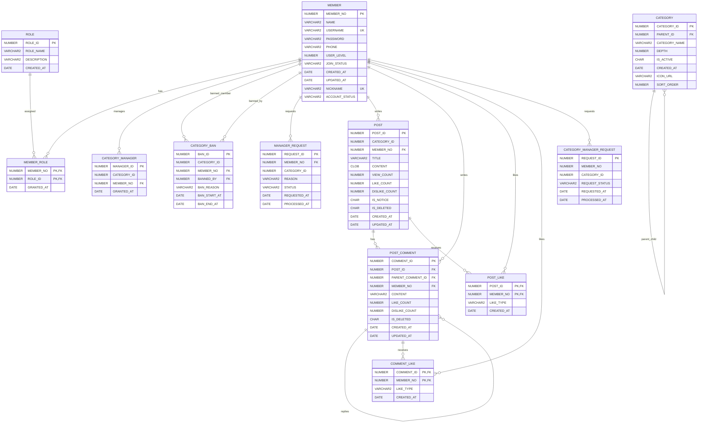

# 🎮 GAMEHUB

> **게임으로 연결되고, 커뮤니티로 성장하는 공간**
>
> 게임 카테고리별 게시판을 중심으로 회원·등급·권한·게시글·댓글·좋아요 기능을 구현한 **Java Servlet 기반 게임 커뮤니티 프로젝트**입니다.

---

## 📌 Project Overview

**GAMEHUB**는 게임별로 분리된 커뮤니티 공간에서 사용자가 게시글과 댓글을 작성하고, 좋아요/싫어요를 통해 서로 소통할 수 있도록 만든 웹 커뮤니티입니다.

단순한 게시판 CRUD를 넘어 **회원 등급 → 역할(Role) → 카테고리 관리자 → 관리자 신청**으로 이어지는 권한 구조를 설계하여 실제 커뮤니티 서비스에 가까운 기능을 구현했습니다.

### 🎯 핵심 목표

- 게임 카테고리별 커뮤니티 제공
- 회원/게시글/댓글 CRUD 구현
- 좋아요·싫어요 및 회원 레벨 시스템 구현
- 역할(Role)에 따른 권한 관리
- 카테고리 관리자 신청 및 관리 기능 구현
- Java Servlet + DAO/DTO 구조를 통한 MVC 형태의 웹 애플리케이션 구현

---

## ✨ 주요 기능

### 👤 회원

- 회원가입
- 로그인 / 로그아웃
- 마이페이지
- 회원 정보 조회
- 회원 레벨 관리
- 좋아요/싫어요 기반 활동 정보
- 계정 상태 관리

### 🎮 게임 카테고리

- 게임 카테고리 조회
- 계층형 카테고리 구성
- 카테고리별 게시판 이동
- 카테고리 활성/비활성 관리
- 카테고리 관리자 기능

### 📝 게시글

- 게시글 작성
- 게시글 목록 조회
- 게시글 상세 조회
- 게시글 수정
- 게시글 삭제
- 조회수 증가
- 공지사항 구분
- 좋아요 / 싫어요
- 작성자 권한에 따른 수정/삭제 처리

### 💬 댓글

- 댓글 작성
- 댓글 조회
- 대댓글 구조
- 댓글 삭제
- 댓글 좋아요 / 싫어요

### 🔐 권한 / 관리자

- MEMBER / ROLE 기반 권한 구조
- 카테고리 관리자 신청
- 카테고리 관리자 지정
- 카테고리 이용 제한(BAN)
- 관리자 신청 상태 관리

---

## 🛠️ Tech Stack

| 구분 | 기술 |
|---|---|
| Language | Java |
| Backend | Servlet / Jakarta Servlet |
| Server | Apache Tomcat 10.1 |
| Database | Oracle Database |
| DB Access | JDBC |
| Frontend | HTML5 / CSS3 / JavaScript |
| Data Format | JSON |
| Build | Maven |
| IDE | IntelliJ IDEA |
| Version Control | Git / GitHub |

---

## 🏗️ Architecture

```text
┌───────────────────────────────────────────────┐
│                   Browser                     │
│             HTML / CSS / JavaScript           │
└──────────────────────┬────────────────────────┘
                       │ HTTP / JSON
                       ▼
┌───────────────────────────────────────────────┐
│                Servlet Layer                  │
│  Login / Post / Comment / Like / Manager ...  │
└──────────────────────┬────────────────────────┘
                       │
                       ▼
┌───────────────────────────────────────────────┐
│                  DAO Layer                    │
│       MemberDAO / PostDAO / CategoryDAO       │
│          CommentDAO / LikeDAO ...              │
└──────────────────────┬────────────────────────┘
                       │ JDBC
                       ▼
┌───────────────────────────────────────────────┐
│                 Oracle DB                     │
│ MEMBER / POST / COMMENT / CATEGORY / ROLE ... │
└───────────────────────────────────────────────┘
```

### 📁 Project Structure

```text
src/main
├─ java/com/gamecommunity
│  ├─ dao
│  │  ├─ CategoryDAO.java
│  │  ├─ CategoryManagerRequestDAO.java
│  │  ├─ MemberDAO.java
│  │  ├─ PostDAO.java
│  │  └─ ...
│  │
│  ├─ dto
│  │  ├─ CategoryDTO.java
│  │  ├─ MemberDTO.java
│  │  ├─ PostDTO.java
│  │  └─ ...
│  │
│  └─ servlet
│     ├─ LoginServlet.java
│     ├─ LogoutServlet.java
│     ├─ PostListServlet.java
│     ├─ PostDetailServlet.java
│     ├─ PostWriteServlet.java
│     ├─ PostEditServlet.java
│     ├─ PostUpdateServlet.java
│     ├─ PostDeleteServlet.java
│     └─ ...
│
└─ webapp
   ├─ css
   │  └─ gamehub.css
   ├─ js
   │  ├─ common.js
   │  ├─ layout.js
   │  ├─ game-nav.js
   │  └─ ...
   └─ *.html
```

---

## 🗄️ Database

Oracle Database를 사용하여 회원, 역할, 카테고리, 게시글, 댓글, 좋아요 및 관리자 관련 데이터를 관계형 구조로 관리했습니다.

### ERD



---

## 🔐 주요 제약조건

### MEMBER

- `PK_MEMBER` : `MEMBER_NO` 기본키
- `UK_MEMBER_USERNAME` : `USERNAME` UNIQUE
- `UK_MEMBER_NICKNAME` : `NICKNAME` UNIQUE
- `USER_LEVEL` : `1 ~ 50`
- `JOIN_STATUS` : `PENDING / APPROVED / REJECTED`
- `ACCOUNT_STATUS` : `ACTIVE / WITHDRAWN / BANNED / DORMANT`

### CATEGORY

- `PK_CATEGORY` : `CATEGORY_ID` 기본키
- `FK_CATEGORY_PARENT` : `PARENT_ID → CATEGORY.CATEGORY_ID`
- `DEPTH` : `1 / 2 / 3`
- `IS_ACTIVE` : `Y / N`

### POST

- `PK_POST` : `POST_ID` 기본키
- `FK_POST_MEMBER` : `MEMBER_NO → MEMBER.MEMBER_NO`
- `VIEW_COUNT >= 0`
- `LIKE_COUNT >= 0`
- `DISLIKE_COUNT >= 0`
- `IS_NOTICE` : `Y / N`
- `IS_DELETED` : `Y / N`

### POST_COMMENT

- `PK_POST_COMMENT` : `COMMENT_ID` 기본키
- `FK_COMMENT_POST` : `POST_ID → POST.POST_ID`
- `FK_COMMENT_MEMBER` : `MEMBER_NO → MEMBER.MEMBER_NO`
- `FK_COMMENT_PARENT` : `PARENT_COMMENT_ID → POST_COMMENT.COMMENT_ID`
- `LIKE_COUNT >= 0`
- `DISLIKE_COUNT >= 0`
- `IS_DELETED` : `Y / N`

### POST_LIKE / COMMENT_LIKE

- 각각 `(POST_ID, MEMBER_NO)`, `(COMMENT_ID, MEMBER_NO)` 복합 기본키
- `LIKE_TYPE` : `LIKE / DISLIKE`
- 동일 회원의 중복 반응을 방지하는 구조

### MEMBER_ROLE

- `(MEMBER_NO, ROLE_ID)` 복합 기본키
- `MEMBER_NO → MEMBER.MEMBER_NO`
- `ROLE_ID → ROLE.ROLE_ID`

### CATEGORY_MANAGER

- `MANAGER_ID` 기본키
- `MEMBER_NO → MEMBER.MEMBER_NO`
- `(CATEGORY_ID, MEMBER_NO)` UNIQUE

### CATEGORY_BAN

- `BAN_ID` 기본키
- `MEMBER_NO → MEMBER.MEMBER_NO`
- `BANNED_BY → MEMBER.MEMBER_NO`

### MANAGER_REQUEST

- `REQUEST_ID` 기본키
- `MEMBER_NO → MEMBER.MEMBER_NO`
- `STATUS` : `PENDING / APPROVED / REJECTED`

---

## 👥 Team

| 구분 | 담당 |
|---|---|
| 팀원 1 | DAO / DTO / DB 설계 및 데이터 처리 |
| 팀원 2 | Servlet / 백엔드 기능 구현 |
| 팀원 3 | HTML / CSS / JavaScript / 화면 구현 |

> 팀원별 담당 영역을 나누되 Git 브랜치 기반으로 기능을 개발하고 `develop`에서 통합하는 방식으로 협업했습니다.

---

## 🌿 Git 협업 전략

```text
main
  │
  └── develop
        ├── feature/login
        ├── feature/post
        ├── feature/comment
        └── feature/*
```

- `main` : 최종 안정 버전
- `develop` : 기능 통합 및 테스트
- `feature/*` : 개별 기능 개발
- 기능 개발 후 `develop`에 병합하여 통합 테스트 진행

---

## 💡 프로젝트를 통해 배운 점

### DAO / DTO / Servlet 간 DB 연결

Servlet에서 요청을 처리하고 DTO로 데이터를 전달한 뒤 DAO를 통해 Oracle DB에 접근하는 흐름을 직접 구현하면서 각 계층의 역할과 데이터 전달 구조를 이해했습니다.

### 객체 설계 및 데이터 전달

회원, 게시글, 댓글, 카테고리 등 도메인별 DTO를 구성하고 DAO에서 SQL 결과를 객체로 변환하는 과정을 통해 객체 중심으로 데이터를 관리하는 방법을 익혔습니다.

### 화면과 서버의 연결

HTML / CSS / JavaScript에서 Fetch API로 Servlet을 호출하고 JSON 데이터를 받아 화면에 반영하면서 프론트엔드와 백엔드가 연결되는 전체 흐름을 경험했습니다.

### Git 협업

`feature → develop → main` 흐름으로 브랜치를 관리하고 충돌을 해결하면서 여러 명이 하나의 프로젝트를 개발할 때 필요한 Git 협업 과정을 경험했습니다.

---

## 🔧 아쉬운 점 & 개선 방향

- 팀장으로서 초기 역할 분담과 개발 일정 관리가 더 체계적이지 못했던 점
- 기능을 구현하는 과정에서 공통 코드와 화면 구조를 더 일찍 정리하지 못했던 점
- 기능 추가 과정에서 발생하는 브랜치 및 코드 충돌을 사전에 줄일 수 있는 개발 규칙이 필요했던 점

### 🚀 다음 목표

이번 프로젝트를 다시 검토하면서 부족했던 부분을 개선하고, 프로젝트 구조와 구성 방식을 반복해서 학습하여 다음 프로젝트에서는 더 체계적으로 설계하고 협업하는 것을 목표로 합니다.

---

## 📎 Project Repository

**GAMEHUB — Game Community Web Project**

```text
Java Servlet + Oracle + HTML/CSS/JavaScript
```
