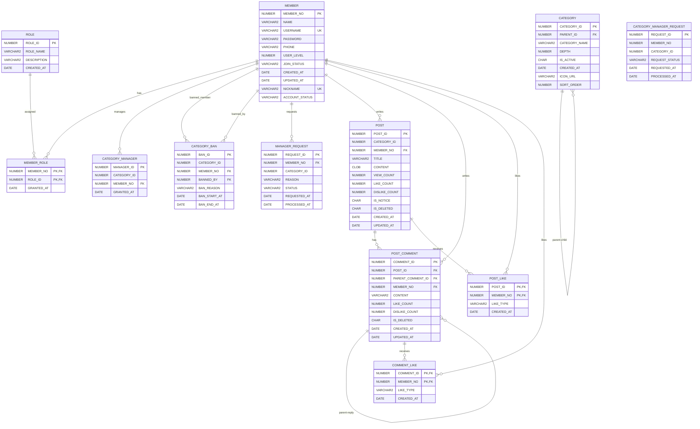

# 🎮 Game Community

게임 카테고리별 커뮤니티 웹 프로젝트

## 📌 프로젝트 소개

게임별 게시판을 제공하고
회원 등급 및 카테고리 관리자 기능을 지원하는 커뮤니티입니다.

## 🛠️ 기술 스택

- Java
- Servlet / JSP
- Apache Tomcat
- Oracle
- HTML / CSS / JavaScript
- Git / GitHub

## 🏗️ 프로젝트 구조

```text
src
 └─ main
    ├─ java
    │  └─ com.gamecommunity
    │     ├─ dao
    │     ├─ dto
    │     └─ servlet
    └─ webapp
       ├─ css
       ├─ js
       └─ *.html


✨ 주요 기능
회원가입 / 로그인 / 로그아웃
게임 카테고리 조회
게시글 CRUD
댓글
게시글 좋아요 / 싫어요
회원 등급
카테고리 관리자 신청
카테고리 관리자 권한
게시글 삭제 및 수정


👥 팀원 역할
팀원	담당
팀원 1	DAO / DTO / DB
팀원 2	Servlet / 기능 구현
팀원 3	HTML / CSS / JavaScript / 화면 구현


🗄️ DB
Oracle Database를 사용하여 회원, 게시글, 댓글,
카테고리, 권한 및 좋아요 데이터를 관리했습니다.

## 🗄️ ERD


### 🔐 주요 제약조건

#### MEMBER

* `PK_MEMBER` : `MEMBER_NO` 기본키
* `UK_MEMBER_USERNAME` : `USERNAME` UNIQUE
* `UK_MEMBER_NICKNAME` : `NICKNAME` UNIQUE
* `USER_LEVEL` : `1 ~ 50`
* `JOIN_STATUS` : `PENDING / APPROVED / REJECTED`
* `ACCOUNT_STATUS` : `ACTIVE / WITHDRAWN / BANNED / DORMANT`

#### CATEGORY

* `PK_CATEGORY` : `CATEGORY_ID` 기본키
* `FK_CATEGORY_PARENT` : `PARENT_ID → CATEGORY.CATEGORY_ID`
* `DEPTH` : `1 / 2 / 3`
* `IS_ACTIVE` : `Y / N`

#### POST

* `PK_POST` : `POST_ID` 기본키
* `FK_POST_MEMBER` : `MEMBER_NO → MEMBER.MEMBER_NO`
* `VIEW_COUNT >= 0`
* `LIKE_COUNT >= 0`
* `DISLIKE_COUNT >= 0`
* `IS_NOTICE` : `Y / N`
* `IS_DELETED` : `Y / N`

#### POST_COMMENT

* `PK_POST_COMMENT` : `COMMENT_ID` 기본키
* `FK_COMMENT_POST` : `POST_ID → POST.POST_ID`
* `FK_COMMENT_MEMBER` : `MEMBER_NO → MEMBER.MEMBER_NO`
* `FK_COMMENT_PARENT` : `PARENT_COMMENT_ID → POST_COMMENT.COMMENT_ID`
* `LIKE_COUNT >= 0`
* `DISLIKE_COUNT >= 0`
* `IS_DELETED` : `Y / N`

#### POST_LIKE

* `POST_ID + MEMBER_NO` **복합 기본키**
* `POST_ID → POST.POST_ID`
* `MEMBER_NO → MEMBER.MEMBER_NO`
* `LIKE_TYPE` : `LIKE / DISLIKE`

#### COMMENT_LIKE

* `COMMENT_ID + MEMBER_NO` **복합 기본키**
* `COMMENT_ID → POST_COMMENT.COMMENT_ID`
* `MEMBER_NO → MEMBER.MEMBER_NO`
* `LIKE_TYPE` : `LIKE / DISLIKE`

#### MEMBER_ROLE

* `MEMBER_NO + ROLE_ID` **복합 기본키**
* `MEMBER_NO → MEMBER.MEMBER_NO`
* `ROLE_ID → ROLE.ROLE_ID`

#### CATEGORY_MANAGER

* `MANAGER_ID` 기본키
* `MEMBER_NO → MEMBER.MEMBER_NO`
* `CATEGORY_ID + MEMBER_NO` UNIQUE

#### CATEGORY_BAN

* `BAN_ID` 기본키
* `MEMBER_NO → MEMBER.MEMBER_NO`
* `BANNED_BY → MEMBER.MEMBER_NO`

#### MANAGER_REQUEST

* `REQUEST_ID` 기본키
* `MEMBER_NO → MEMBER.MEMBER_NO`
* `STATUS` : `PENDING / APPROVED / REJECTED`

#### CATEGORY_MANAGER_REQUEST

* `REQUEST_ID` 기본키
* `MEMBER_NO`, `CATEGORY_ID`는 현재 제공된 실제 FK 제약조건 목록에는 FK가 없음
* `REQUEST_STATUS`에 대한 CHECK 제약조건은 현재 제공된 목록에 없음

```


🔀 Git 협업
* main : 최종 배포
* develop : 개발 통합
* feature/* : 기능별 개발
